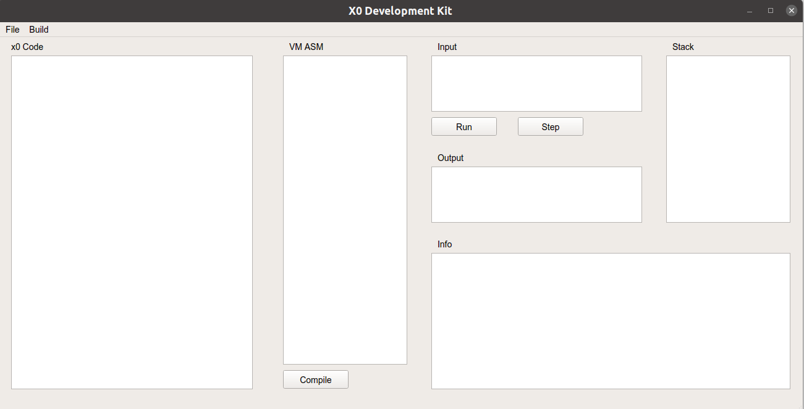

# ECNU X0 Compiler

End-term project of the **Practice of Compiler Principles** in **East China Normal University**.

### **1. Dependencies**

**Operating System:** Ubuntu 20.04 LTS

**X0 Compiler Requirements:** flex - 2.6.4, bison - 3.5.1, gcc - 9.3.0, make - 4.2.1

**X0 IDE Requirements:** g++ - 9.3.0, Qt - 5.9.7, Qt Creator - 5.0.3

### **2. How to Run the Code**

(1) Compile the **x0_compiler**

Run ```make``` at the root directory of this project to get the **x0_compiler**.

(2) Compile the **x0_ide**

Run **Qt Creator** and open the project file **x0_ide/x0_ide.pro**. Compile and run the project.



(3) Configure the Path of the **x0_compiler**

Click the **Compile** button or Choose **Build/Set Compiler Path...** in the menu bar. Set the path of the **x0_compiler** previously compiled in (1).

(4) **Do Anything You Want**

